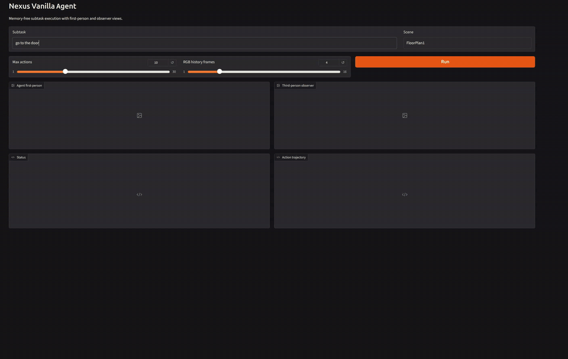
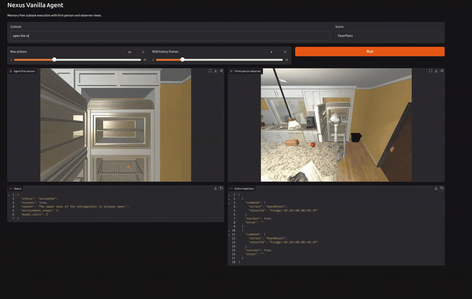

# Nexus Memory

## Current Prototype Demos

사용자가 직접 `sub_task`를 입력하면 memory-free low-level agent가 누적 RGB와
현재 보이는 객체 metadata를 바탕으로 행동합니다. 콘솔에서는 agent가 실제로
사용하는 1인칭 관측과 디버깅용 3인칭 observer, 실행 결과와 action trajectory를
함께 확인할 수 있습니다.

**`go to the door`**



**`open the refrigerator and break the egg into the floor`**



> 이 데모들은 최종 성능을 주장하는 결과가 아니라, high-level memory를
> 실험하기 전에 구축 중인 low-level subtask execution 기준선의 현재 동작을
> 보여줍니다.

## 궁극적인 목표

상위 memory 시스템이 하나의 `sub_task`를 만들면, low-level agent가
AI2-THOR의 현재 RGB와 현재 보이는 객체 metadata를 이용해 그 subtask의
action chunk를 실행하는 구조를 만든다.

현재 단계에서는 memory, high-level planner, skill library를 다루지 않는다.
먼저 아래 단일 루프를 안정적으로 만드는 데 집중한다.

```python
result = run_agent_loop(
    controller,
    sub_task="Pick up the apple",
    max_steps=10,
    image_history_steps=4,
)
```

루프는 매 tick에 하나의 검증된 AI2-THOR action만 실행한다. 모델이
`complete`를 반환하면 즉시 성공 종료하고, action 예산을 모두 사용하면 마지막
관측으로 subtask 성공 여부를 한 번 판정한 뒤 종료한다.

`image_history_steps`는 같은 subtask 안에서 유지할 RGB 시계열의 최대 길이다.
프레임은 복사해 저장하며 모델에는 최신 프레임부터 역시간순으로 전달한다.

## 현재 구성

- `app.py`: 직접 subtask를 입력하는 최소 Gradio 콘솔
- `observer.py`: 정책과 격리된 AI2-THOR 3인칭 추적 카메라
- `vanilla_agent.py`: memory-free low-level loop, metadata 필터, 출력 검증
- `inference.py`: stateless HTTP client/server 계약
- `inference_2.py`: Gemma 4 12B NF4 모델 서버

정책에는 현재 보이는 객체, inventory, 카메라 방향, 직전 action feedback만
전달한다. 보이지 않는 객체, 월드 좌표, reachable positions, evaluator 정답은
전달하지 않는다. `Teleport`, `forceAction`, `Pass`도 실행할 수 없다.

## 실행

모델 서버가 `127.0.0.1:8001`에서 실행 중일 때:

가벼운 웹 콘솔:

```bash
uv run python app.py
```

브라우저에서 `http://127.0.0.1:7860`을 열고 subtask를 직접 입력한다. 콘솔은
agent의 1인칭 RGB, 뒤·위에서 따라가는 3인칭 observer RGB, 상태와 action
trajectory를 함께 갱신한다. Observer camera action은 정책 입력과 분리된다.

CLI:

```bash
uv run python vanilla_agent.py "Pick up the apple" --scene FloorPlan1 \
  --max-steps 10 --image-history-steps 4
```

검증:

```bash
uv run pytest -q
uv run ruff check .
uv run ruff format --check .
```
